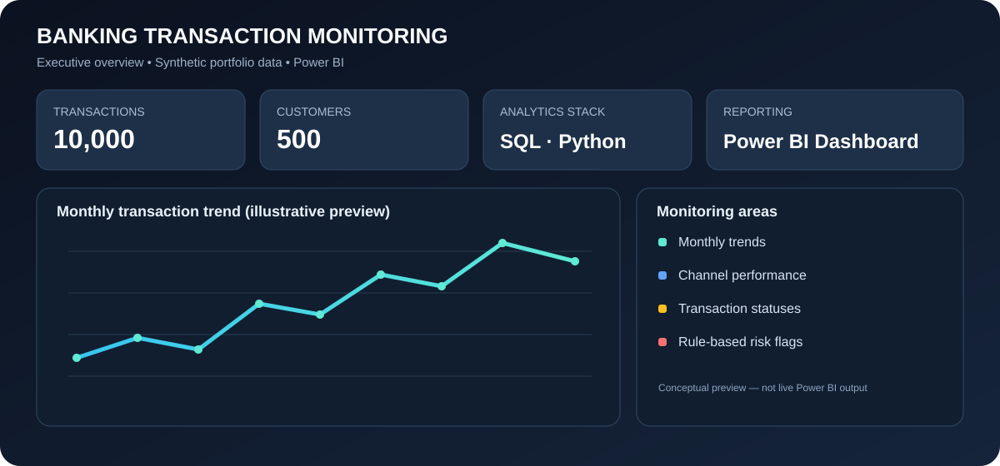

# 🏦 Banking Transaction Monitoring System

<p align="center">
  
</p>

<p align="center">
  <strong>SQL · Python · Power BI</strong><br/>
  Transaction trends • Channel performance • Status monitoring • Rule-based risk review
</p>

<p align="center">
  <a href="powerbi/Banking_Transaction_Monitoring_Dashboard.pbix">📊 Open / Download Power BI Dashboard</a> ·
  <a href="project_summary.pdf">📄 Project Summary</a>
</p>

---

## ✨ Project Overview
A portfolio project using SQL, Python, and Power BI to analyze banking transaction activity, monitor transaction channels and statuses, and review rule-flagged transactions.

## 📌 Project Highlights
- **10,000 synthetic transactions** and **500 synthetic customer records**
- SQL schema with primary/foreign keys, indexes, and analytical queries
- Python data-quality checks, KPI summaries, and charts
- Power BI dashboard for executive overview and risk review
- Processed summary CSVs and a project summary PDF

## 🖥️ Dashboard
The graphic above is a **conceptual preview** for the repository landing page, not a screenshot of live Power BI output. The full interactive report should be opened in Power BI Desktop from `powerbi/Banking_Transaction_Monitoring_Dashboard.pbix`.

Suggested report pages:
- **Executive Overview:** KPI cards, monthly trend, channel value, transaction status, slicers
- **Risk Review:** flagged transaction table, flagged counts by channel, date/channel filters
- **Customer & Merchant Insights:** city and merchant-category analysis

## 🗂️ Repository Structure
```text
data/
  raw/          # customers.csv, transactions.csv
  processed/    # analytical summary CSVs
sql/             # database setup, schema, analysis queries
python/          # reproducible Python analysis
notebooks/       # exploratory Jupyter notebook
powerbi/         # interactive Power BI dashboard
assets/          # README dashboard preview
project_summary.pdf
```

## ⚙️ Run the Python Analysis
Install dependencies:
```bash
pip install pandas numpy matplotlib jupyter nbformat
```
Then run from the project root:
```bash
python python/analysis.py
```

## 🛢️ SQL Setup
1. Run `sql/01_create_database.sql` in MySQL Workbench.
2. Run `sql/02_create_tables.sql`.
3. Import `data/raw/customers.csv` and `data/raw/transactions.csv` into their corresponding tables.
4. Run `sql/03_analysis_queries.sql`.

## ⚠️ Data & Limitations
All data is **synthetic** and generated for demonstration. The `risk_flag` field uses simple illustrative rules (for example, high transaction amount); it is **not a production fraud-detection model**. Do not describe this as real bank experience or production fraud detection.

## 💼 Resume Bullet
> Built a banking transaction analytics portfolio project using SQL, Python (Pandas), and Power BI to analyze 10,000 synthetic transactions, track channel and monthly KPIs, and review rule-based risk flags.
